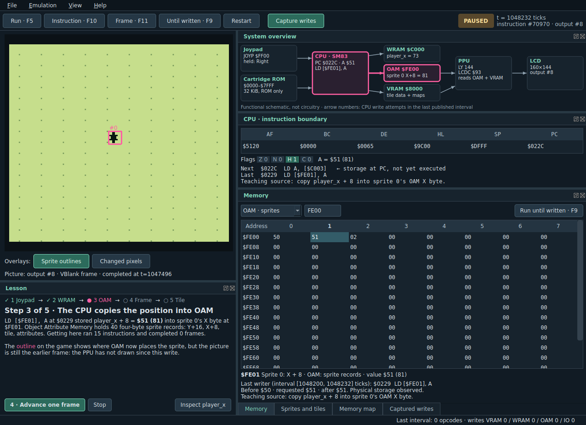
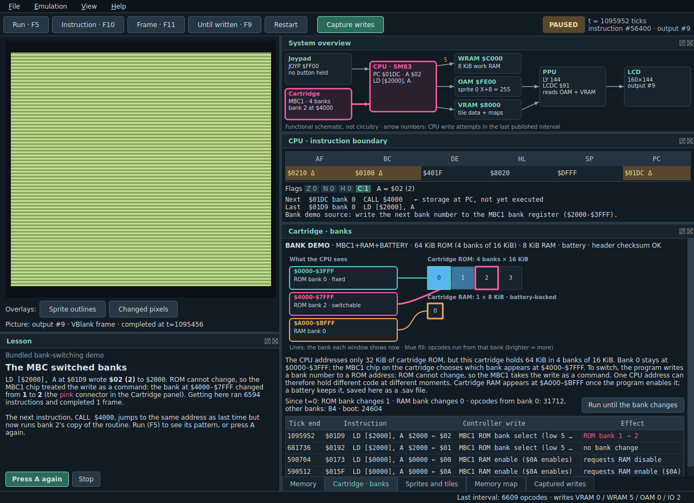

# Console Observatory

A native desktop Game Boy teaching lab. Run an original tiny game, press Right,
and follow the change from the joypad register through a CPU instruction to
`player_x`, sprite memory, the next displayed frame, and the tile bits that
make the picture. Then open any Game Boy ROM you own and watch the same
panels, including which cartridge banks the CPU can see and every bank
switch. C++20 / Qt 6 Widgets / SameBoy; Linux and Windows.



The application starts paused with its bundled game already visible. Normal
use works offline in one executable with ordinary Qt runtime libraries. No
browser, local server, account, backend, or proprietary boot ROM is required,
and no commercial game is included.

## What you can do

- **Follow one press of Right** (Lesson panel). Five steps, each ended by a
  real emulator event: hold Right → run until the CPU stores `player_x` →
  run until it copies `player_x + 8` into sprite 0's OAM X byte (an outline
  shows where OAM now puts the sprite, ahead of the unchanged picture) →
  advance one frame (changed pixels are marked) → read the sprite's tile bits.
  The system overview highlights the path at every step.
- **Run until written** (F9): select any memory byte and run until the CPU
  writes it. All panels then show that instruction boundary.
- **Sprites and tiles**: the 40 OAM records, VRAM tiles in 128-tile blocks,
  and the selected tile's rows as two bit-plane bytes that combine into
  colour numbers, then shades through the palette register.
- **Memory map**: all 64 KiB, one cell per address, coloured by CPU write
  attempts and opcode starts over a labelled interval, with a page magnifier.
- **Step** one instruction (F10) or to the next completed frame (F11), with
  registers, flags, disassembly, memory, and captured writers in step.
- **Open any Game Boy ROM** (File › Open, Ctrl+O, or drop a `.gb`/`.gbc`
  file on the window), up to 8 MiB, with any controller SameBoy emulates
  (none, MBC1, MBC2, MBC3 with clock, MBC5, MBC7, MMM01, HuC1, HuC3, camera,
  TPP1). It starts paused at power-on; F5 runs it.
- **Cartridge · banks** panel: the CPU's three cartridge windows
  (`$0000–$3FFF`, `$4000–$7FFF`, `$A000–$BFFF`) on the left, every ROM and
  RAM bank of the cartridge on the right, and lines showing which bank each
  window shows right now. Banks are shaded by how many opcodes ran from them.
  A plain-language explanation adapts to the cartridge's controller, and a
  list shows each controller write (`$2000 ← $02  MBC1 ROM bank select`)
  with its effect (`ROM bank 1 → 2`). **Run until the bank changes** stops
  right after the next switch. Memory and CPU panels name the mapped bank and
  the file offset, so the same address showing different code is explained.


- **Bank-switching demo** (File › Bundled examples): an original MBC1
  cartridge whose banks 1–3 each keep a different routine at `$4000`. The
  Lesson panel presses A and stops at the real bank switch.
- **Battery saves**: battery-backed cartridge RAM is read from and written to
  a `.sav` file next to the ROM (same name), automatically every few seconds
  while it changes, when you open another game, and on exit (File › Save
  battery RAM now: Ctrl+S). The format is SameBoy's: raw RAM, plus a clock
  footer for MBC3/HuC3/TPP1 clocks.
- **OAM DMA as a writer**: most commercial games build their sprite table in
  work RAM and copy it into OAM with the hardware's DMA (writing a page number
  to `$FF46`). The app records each request with the instruction that made it
  and checks OAM against the source once the copy has finished. Select a
  sprite byte and the writer panel says "OAM DMA from `$C100`…"; click the
  source address to see which instruction put the value there. Run until
  written (F9) on an OAM byte stops after the copy. The system overview shows
  the copy as a WRAM → OAM arrow with a count.
- **Explanatory tooltips** on everything: registers and flags, every memory
  byte (its region, and for hardware registers what that register does),
  each part and arrow of the system overview, banks, tiles down to a single
  bit or pixel, panels (hover a tab or title bar), and every button. Written
  for a curious newcomer: what it is, why it matters, how to use it.

Panels dock, tab, float, and close; **View › Reset layout** restores them.
Arrows move the star. Z/X, Backspace, and Enter map to Game Boy
A/B/Select/Start; this game only uses directions. Game keys work while tables
have focus, text fields keep their keys, and Enter still activates a focused
button. Losing window focus releases held buttons.

`player_x`/`player_y` are screen coordinates at `$C000`/`$C001`; `$C002` stores
polled buttons and `$C003` counts game updates modulo 256. Sprite 0's X/Y bytes
are at `$FE01`/`$FE00`: OAM X is `player_x + 8`, OAM Y is `player_y + 16`.
These names are source annotations, enabled only when ROM bytes exactly match
the bundled demo. The program polls once per VBlank and clamps movement to the
160×144 display. This is a teaching game, not a commercial title. Other ROMs
get no variable names: names come only from a bundled program's own source.

## Build and run — Ubuntu 24.04 x86-64

```bash
sudo apt update
sudo apt install build-essential cmake ninja-build python3 qt6-base-dev qt6-base-dev-tools
git clone https://github.com/esotericode/blink.git
cd blink
cmake -S . -B build -G Ninja -DCMAKE_BUILD_TYPE=Release
cmake --build build --parallel
ctest --test-dir build --output-on-failure
./build/console-observatory
```

Tested: GCC 13.3.0, Qt 6.4.2, CMake 3.28.3, Ninja 1.11.1, Python 3.12.3.
Minimums: CMake 3.22, Python 3.8, Qt 6.4, a GNU-compatible C11 compiler and
C++20 compiler. SameBoy's exact source is vendored, so configuration/build do
not fetch dependencies. See `DEPENDENCIES.lock.json` for the reference inputs.
Use `-DOBSERVATORY_STRICT_DEPENDENCIES=ON` to require the reference Qt 6.4.2.

For Qt installed in a nonstandard prefix, add
`-DCMAKE_PREFIX_PATH=/path/to/Qt/6.x/gcc_64`. On a machine without a desktop,
CTest's widget suite uses Qt's offscreen plugin. Test X11 separately with:

```bash
sudo apt install xvfb xauth
xvfb-run -a ./build/widget_tests
```

## Build and run — Windows 10/11 x64

The SameBoy core is GNU C, so Windows builds use the **MinGW-w64** toolchain
that Qt's own installer provides. MSVC's `cl.exe` cannot compile the core;
configuration stops with an explanation if it is selected.

One-time setup:

1. Run the [Qt Online Installer](https://www.qt.io/download-qt-installer-oss).
   Select **Qt › Qt 6.8.x › MinGW 13.1.0 64-bit** and, under **Build Tools**,
   **MinGW 13.1.0 64-bit**, **CMake**, and **Ninja**.
2. Install Python 3.8+ (`winget install Python.Python.3.12`, or python.org with
   "Add python.exe to PATH") and Git (`winget install Git.Git`).

Open **Qt 6.8.x (MinGW 13.1.0 64-bit)** from the Start menu; it puts Qt and
MinGW on `PATH`. Then, assuming Qt's default `C:\Qt` location:

```bat
set PATH=C:\Qt\Tools\CMake_64\bin;C:\Qt\Tools\Ninja;%PATH%
git clone https://github.com/esotericode/blink.git
cd blink
cmake -S . -B build -G Ninja -DCMAKE_BUILD_TYPE=Release
cmake --build build --parallel
ctest --test-dir build --output-on-failure
build\console-observatory.exe
```

From a plain terminal instead, put `C:\Qt\Tools\mingw1310_64\bin` first on
`PATH` and add `-DCMAKE_PREFIX_PATH=C:/Qt/6.8.3/mingw_64` to the configure
command. In Qt Creator, open `CMakeLists.txt` and choose the
**Desktop Qt 6.8.x MinGW 64-bit** kit.

`.gitattributes` keeps LF line endings on checkout so the vendored SameBoy
files match their SHA-256 manifest; keep it if you copy the sources.

### Portable Windows package

```bat
cmake --install build --prefix out\install
cpack --config build\CPackConfig.cmake -B out
```

This writes `out\console-observatory-0.4.0-windows-x64.zip` (about 12 MB). Installing runs
`windeployqt` (through Qt's CMake deployment support), which copies the Qt
DLLs, platform and style plugins, the MinGW runtime, and a `qt.conf` beside
`console-observatory.exe`. Unzip anywhere and run the `.exe`; the target
machine needs no Qt, MinGW, or Python. The folder also holds the README,
notices, licenses, and the ROM source. The executable is not code-signed, so
Windows SmartScreen may ask for confirmation the first time.

`console-observatory.exe --screenshot shot.png` renders the window to an image
and exits; CI uses it to launch the packaged app with Qt and MinGW removed
from `PATH`.

## ROM source and rebuilding

```bash
python3 tools/assemble_rom.py --source rom --output out/rom
./build/console-observatory out/rom/teaching.gb
```

`rom/teaching.asm` contains all game code and original tile/sprite data.
`rom/bankdemo.asm` is the original MBC1 bank-switching demo (four 16 KiB ROM
banks, 8 KiB battery-backed RAM); `BANK n` places code in ROM bank n.
`rom/boot.asm` is an original 256-byte boot program: it clears VRAM, sets the
sound and LCD registers and CPU registers to the documented DMG post-boot
values (AF = `$01B0`, or `$0180` when the header checksum is 0; BC = `$0013`,
DE = `$00D8`, HL = `$014D`, SP = `$FFFE`, LCDC = `$91`, BGP = `$FC`), disables
boot mapping, and transfers to cartridge `$0100`. Games rely on that state. It
does not scroll a logo or validate the header, and the timing of the handoff
differs from hardware. No Nintendo logo is embedded. The strict, two-pass
Python assembler supports the subset actually used, rejects unsupported
syntax and overlaps, resolves symbols, and writes checksums. No RGBDS is
required.

Outputs: `teaching.gb`, `bankdemo.gb`, `boot.bin`, `.sym` files (`BB:AAAA`
with the real bank), `manifest.json`, and the generated embedding header.
CMake runs the same assembler and embeds all three binaries into the
executable. Reference SHA-256: teaching ROM
`e7ef9ff22686174b0ccfabc86e44fd3fcf65561f486cb4f236cb674a69d9d672`, bank
demo `b9c2530bff25161ac3810d893263ab54cee99ade64a0526a61bc7551e746c8c7`, boot
`e758c75ff459e3ac8786850d551c49c2e6b5c1ef64f9d7757b9b59eb67e1895f`.
Editing the ROM rebuilds its embedding and source-defined annotation addresses.
The Windows icon is generated from the SVG design by `tools/make_icon.py`.

## Install or create a Linux package

```bash
cmake --install build --prefix "$PWD/out/install"
./out/install/bin/console-observatory
cpack --config build/CPackConfig.cmake -B out
sudo apt install ./out/console-observatory_0.4.0_amd64.deb
console-observatory
```

The Ubuntu 24.04 `.deb` includes a desktop launcher, icon, the original ROM
source/binaries, assembler, and license notices. It uses dynamically linked OS
Qt packages. Developer tools are needed only to build/rebuild; the installed
app needs the Qt runtime. Cross-distribution packages, AppImage, and macOS are
not verified yet. Build without verification executables with
`-DBUILD_TESTING=OFF`, or only the Qt-free core and its tests with
`-DOBSERVATORY_BUILD_GUI=OFF`.

## State, tracing, and exact limits

- CPU registers, next instruction storage bytes, memory contents, VRAM, OAM,
  and hardware register storage are copied at one instruction boundary. A
  paused inspector never advances emulation. IO values are **raw core
  storage**, not synthesized CPU bus reads; absent storage shows `—`.
- The picture is the latest completed core output, with its own frame number,
  output kind, and enclosing instruction-boundary tick. It stays unchanged
  while stepping instructions until another completed output arrives. The
  previous output is kept so changed pixels can be marked. Sprite outlines are
  drawn from OAM at the CPU cursor, which can be newer than the picture.
- Instruction step advances through any pending interrupt/wait work until one
  opcode executes. A bounded HALT/STOP wait reports no opcode and shows the
  time actually advanced. Frame step stops after the next output callback's
  enclosing atomic core step. LCD-off/artificial output is labeled.
- **Run until written** stops at the end of the atomic core step in which the
  CPU attempted a write to the byte (WRAM echo addresses match), or at its
  limit (one emulated second; four frames inside the lesson). It needs write
  capture and records the same evidence as any other captured write.
- Live activity summarizes a labeled interval between published snapshots.
  It counts opcodes and write attempts, not reads, PPU fetches, or bus cycles.
  Write events record the enclosing interval in SameBoy's 8,388,608 Hz ticks,
  executing opcode where available, address/bank, requested data, and observed
  storage before/after. A callback reports an **attempt**, not acceptance.
- The memory map counts CPU write attempts (while capture is on) and opcode
  starts per address since its last clear; loading, restarting, or toggling
  capture clears it. Reads, DMA copies, and PPU fetches are not counted.
- Default history: 4,096 write records. `--trace-capacity 256` selects a smaller
  window (8–65,536). Evictions and incomplete earlier history are displayed.
  Turning capture off/on clears stale writer evidence. The newest 64 attempts
  appear in the list; memory selection searches the whole retained window.
  Selecting historical evidence does not rewind the current state.
- Any cartridge image from 336 bytes to 8 MiB loads; the header decides the
  controller, as in SameBoy. MBC6 and TAMA5 (not emulated by SameBoy) and
  unknown types are refused before the current game is touched. The machine
  is always a monochrome DMG: Game Boy Color-only games usually show their own
  "requires Game Boy Color" screen, and Super Game Boy features are absent.
  The panel says so for each cartridge.
- Bank views come from SameBoy's public direct-access API, which reports the
  bank mapped into each window; reading them never runs the CPU. A bank
  change is detected at atomic-step boundaries and attributed to the captured
  controller write in that step. Cartridge RAM views show the selected bank's
  storage whether or not the program has RAM enabled (the CPU cannot read it
  while disabled); clock registers are not shown as RAM. MMM01 rearranges ROM
  inside the emulator, so its file offsets are approximate.
- Commercial-game compatibility is SameBoy's; this project has verified the
  bundled cartridges and an MBC5 variant, not a commercial library. Audio is
  emulated but not played.
- OAM DMA is observed, not traced byte by byte: SameBoy has no public DMA
  hook, so the app records the CPU's `$FF46` write (with OAM copied just
  before it) and compares OAM with the source 162 machine cycles later
  (longer if the CPU halts, because SameBoy pauses DMA then), reporting how
  many of the 160 bytes match. Needs Capture writes.
- No read trace, PPU fetch trace, exact write-cycle timestamp, reverse
  execution, pixel provenance, gate model, or automatic complete causality.
  The system overview is a functional schematic, not a circuit diagram.

## Verification and next milestone

Five CTest suites: engine behavior (twelve groups), rendered native Qt widgets,
deterministic ROM generation, vendored source integrity, and a check that every
tooltip the interface uses exists in the glossary and stays short. The engine suite
compares full SameBoy save-state bytes, registers, WRAM, VRAM, OAM, frame
pixels, ticks, and opcode counts with tracing enabled/disabled; checks that
run-until-write reaches the identical state as untraced stepping; verifies
the one-pixel movement and tile decoding against source bytes and rendered
colours; and checks inspection purity, bounded history, interrupt
attribution, HALT, and step synchronization. Cartridge groups check the
post-boot state, MBC1 and MBC5 switching with the writer evidence, banked
disassembly and per-bank counts, cartridge RAM, battery save/restore, banked
trace parity, and pure inspection with a bank mapped. The DMA group checks the
copy's timing against SameBoy itself (the last byte lands inside the checked
window), OAM against the source, restarts, and tracing on/off parity. The widget
suite drives both lessons through their buttons, opens an MBC5 ROM by drag and
drop with an existing `.sav`, follows a DMA-written sprite byte back to its
source, hovers real controls for their tooltips, and asserts the real state at
every stop.

Linux: passed offscreen and under X11 (local and GitHub Actions). Windows:
GitHub Actions builds with official Qt 6.8.3 MinGW, runs all suites, the
widget suite on Qt's native `windows` platform, packaging, and a launch of the
unzipped package; locally, a MinGW cross build passed the suites under Wine.
A physical Windows desktop, real high-DPI monitors, and macOS remain
unverified. See `docs/VERIFICATION.md` for exact evidence.

Next useful milestone: an interrupt/timer timeline lesson (VBlank, STAT, timer)
using real interrupt-flag and execution events, and a background-map view
linking map entries to tiles.

Read `PROJECT_GUIDE.md`, `AGENTS.md`, `STATUS.md`, `DECISIONS.md`, and
`docs/TRACE_CONTRACT.md` before contributing. Third-party licenses and exact
inputs are in `THIRD_PARTY_NOTICES.md` and `third_party/sameboy/UPSTREAM.md`.
